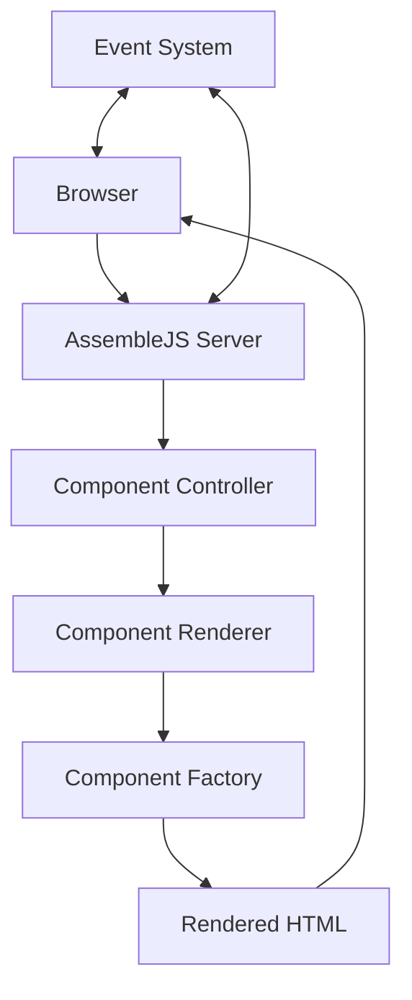

# AssembleJS Documentation and Architecture Guide

This document provides comprehensive information about the AssembleJS framework architecture, components, development workflow, and best practices.

## Table of Contents

- [Architecture Overview](#architecture-overview)
- [Core Concepts](#core-concepts)
- [Detailed Architecture](#detailed-architecture)
- [Technical Implementation](#technical-implementation)
- [Components Reference](#components-reference)
- [Best Practices](#best-practices)
- [Development Setup](#development-setup)
- [Development Workflow](#development-workflow)
- [CLI Guide](#cli-guide)
- [REDLINE: Code Quality Tool](#redline-code-quality-tool)
- [RIVET: Deployment System](#rivet-deployment-system)
- [Website Deployment](#website-deployment)
- [Troubleshooting](#troubleshooting)
- [Development Roadmap](#development-roadmap)
- [Contributing to AssembleJS](#contributing-to-assemblejs)
- [Frequently Asked Questions](#frequently-asked-questions)
- [The AssembleJS Philosophy](#the-assemblejs-philosophy)

## Architecture Overview

AssembleJS follows a distributed micro-frontend architecture designed to enable teams to work independently while maintaining a cohesive user experience. The architecture consists of:

### Core Components

1. **Server**: The AssembleJS server handles request routing, rendering, and component composition
2. **Components**: Isolated UI components that can be composed into larger interfaces
3. **Blueprints**: Composition layers that bring together multiple Components
4. **Event System**: A global event system for communication between components

The architecture of AssembleJS is presented through several PlantUML diagrams that can be rendered in HTML documentation:

1. **Core Architecture**: [readme-assets/architecture.puml](readme-assets/architecture.puml) - Overall system architecture
2. **Request Cycle**: [readme-assets/request_cycle.puml](readme-assets/request_cycle.puml) - How requests flow through the system
3. **Development Lifecycle**: [readme-assets/development_lifecycle.puml](readme-assets/development_lifecycle.puml) - How developers interact with AssembleJS
4. **Blueprint Composition**: [readme-assets/blueprint_composition.puml](readme-assets/blueprint_composition.puml) - How blueprints compose components

### Flow Diagram



## Core Concepts

### Components

Components are the building blocks of AssembleJS. Each Component:

- Has its own isolated code, styles, and templates
- Can use different templating systems (EJS, HTML, Markdown, Preact)
- Manages its own data fetching through Factories
- Communicates with other Components via the Event System

### Blueprints

Blueprints compose multiple Components into a complete user interface. They:

- Define the layout and organization of Components
- Manage routing and navigation
- Handle data sharing between Components
- Provide a common context for Components

### Event System

The Event System enables communication between components:

- Uses a publish/subscribe model
- Supports channels and topics for targeted messaging
- Enables cross-Component and cross-Blueprint communication
- Implements a queue system for reliable message delivery

## Detailed Architecture

### Server-Side Processing

- **Blueprint:** The top-level composition layer that organizes multiple components. Blueprints define the page structure and layout.
  
- **Component:** Self-contained UI elements with their own templates, styles, and client-side logic. Components are device-specific and can be conditionally rendered.
  
- **Factory:** Pre-processing modules that run on the server before rendering. They fetch and transform data needed by components.
  
- **Renderer:** Specialized modules that convert templates (EJS, HTML, Markdown, Preact) into HTML for server-side rendering.
  
- **Server Context:** Shared data store that passes information between factories, components, and the rendering pipeline.

### Client-Side Processing

- **BlueprintClient:** Initializes and manages the overall page interaction in the browser.
  
- **ComponentClient:** Handles individual component behavior, DOM manipulation, and event handling.
  
- **Event Bus:** A publish-subscribe system that enables components to communicate without tight coupling.
  
- **Client Context:** A data store containing component-specific properties and methods available in the browser.

### Request Lifecycle

1. Server receives a request for a Blueprint
2. The Blueprint determines which Components to include
3. For each Component, device-specific views are selected based on user agent
4. Component Factories run to prepare data (API calls, database queries, etc.)
5. Renderers transform templates into HTML using the context data
6. Complete HTML is sent to the client
7. Client-side JavaScript initializes in isolated component islands
8. Components can interact through the Event Bus without direct dependencies

### Component Lifecycle

Components follow a well-defined lifecycle:

1. **Server Preparation**:
   - Factory execution
   - Template compilation
   - HTML rendering

2. **Client Initialization**:
   - DOM attachment
   - Event registration
   - State initialization

3. **Runtime Operation**:
   - Event handling
   - DOM updates
   - Data management

4. **Cleanup**:
   - Resource release
   - Event unsubscription
   - DOM detachment

## Technical Implementation

### Renderer System

The renderer system is pluggable and extensible:

```typescript
interface ComponentRenderer {
  render(context: ComponentContext): string | Promise<string> | Buffer | Promise<Buffer>;
  vendorAssets: Array<NodeAsset>;
}
```

Built-in renderers include:
- EJS Renderer (server-side templating)
- String Renderer (raw HTML)
- Markdown Renderer (content-focused pages)
- Preact Renderer (component-based UIs)

### Factory System

Factories provide a powerful way to prepare data on the server:

```typescript
interface ComponentFactory<Public extends ComponentPublicData = ComponentPublicData, Params extends ComponentParams = ComponentParams> {
  priority: number;
  factory(context: ServerContext<Public, Params>): void | Promise<void>;
}
```

Factories run in priority order, enabling:
- Data fetching from APIs, databases, or files
- Authentication and authorization checks
- Data transformation and preparation
- Request-specific customization

### Event System

The event system enables loose coupling between components:

```typescript
interface BlueprintEvent<T = unknown> {
  address: EventAddress;
  data: T;
  sender: string;
}
```

Components can:
- Publish events to specific addresses
- Subscribe to events from other components
- Receive notifications when relevant events occur
- Update their state and UI in response

## Components Reference

### BlueprintServer

The BlueprintServer is the entry point for an AssembleJS application:

```typescript
import { createBlueprintServer } from 'asmbl';

createBlueprintServer({
  serverRoot: import.meta.url,
  manifest: {
    components: [
      // Components and Blueprints here
    ],
    controllers: [
      // API controllers here
    ]
  }
});
```

### Blueprint

Blueprint is the base class for client-side Component code:

```typescript
import { Blueprint, BlueprintClient } from 'asmbl';

class MyComponent extends Blueprint {
  protected override onMount(): void {
    super.onMount();
    // Initialize your Component here
  }
}

BlueprintClient.registerComponentCodeBehind(MyComponent);
```

### ComponentFactories

Factories run on the server before rendering:

```typescript
import { ComponentContext, ComponentFactory } from 'asmbl';

export class MyFactory implements ComponentFactory {
  async factory(context: ComponentContext): Promise<void> {
    // Fetch data and add to the context
    context.data.set('myData', await fetchSomething());
  }
}
```

## Best Practices

### Project Structure

Organize your AssembleJS project as follows:

```
src/
├── controllers/    # API controllers
├── components/     # UI components
├── blueprints/     # Blueprint compositions
├── factories/      # Data fetching factories
└── server.ts       # Main server entry point
```

### Performance Optimization

- Use Factories for server-side data fetching
- Keep Component templates small and focused
- Avoid deeply nested Components (max 2 levels recommended)
- Use the Event System for asynchronous communication

### Security Best Practices

- Validate all user inputs in Controllers and Factories
- Use authentication middleware for protected routes
- Implement proper error handling
- Follow the principle of least privilege

## Development Setup

### Prerequisites

- [Node.js](https://nodejs.org/) (LTS version recommended)
- [npm](https://www.npmjs.com/) package manager
- Basic knowledge of TypeScript and web development

### Setting Up Development Environment

1. **Clone the repository:**

   ```bash
   git clone https://github.com/zjayers/assemblejs.git
   cd assemblejs
   ```

2. **Install dependencies:**

   ```bash
   npm install
   ```

3. **Build the project:**

   ```bash
   npm run build
   ```

4. **Link for local development:**

   ```bash
   npm run reboot
   ```

## Development Workflow

### Making Changes

1. Create a new branch for your feature or fix:
   ```bash
   git checkout -b feature/your-feature-name
   ```

2. Make your changes to the codebase

3. Run linting and formatting:
   ```bash
   npm run lint:all
   ```

4. Build the project to ensure everything compiles:
   ```bash
   npm run build
   ```

5. Test your changes by linking to example projects:
   ```bash
   npm run reboot
   ```

### Submitting Changes

1. Commit your changes using conventional commit format:
   ```bash
   npm run commit
   ```
   This will guide you through creating a properly formatted commit message.

2. Push your branch to GitHub:
   ```bash
   git push origin feature/your-feature-name
   ```

3. Create a pull request on GitHub

## CLI Guide

AssembleJS provides a powerful command-line interface (CLI) for quickly generating projects, blueprints, components, and other artifacts to streamline your development workflow.

### Installation

The CLI tools are included with the AssembleJS package. You can install globally or use npx for one-off commands:

```bash
# Global installation
npm install -g asmbl

# Or use with npx
npx asmbl <command>
```

### Available Commands

AssembleJS provides several CLI commands:

| Command | Description |
|---------|-------------|
| `asmgen` | Main generator for creating blueprints, components, and other artifacts |
| `asm` | Shorthand for `asmgen` with convenient syntax |
| `asm-build` | Build your AssembleJS application for production |
| `asm-serve` | Start the development server |

### Generator Command (`asmgen`)

The `asmgen` command helps you generate various AssembleJS artifacts:

```bash
npx asmgen [options]
```

#### Options

| Option | Alias | Description |
|--------|-------|-------------|
| `--output=MODE` | `-o` | Set output verbosity [minimal\|standard\|verbose] |
| `--standard` | `-s` | Use standard output mode (more detailed than minimal) |
| `--verbose` | `-v` | Use verbose output mode (maximum detail with examples) |
| `--help` | `-h` | Display help information |


### Output Verbosity

AssembleJS CLI provides three output verbosity levels:

1. **Minimal** (default): Just the essential information to get started
2. **Standard** (`-s`): More detailed information with examples
3. **Verbose** (`-v`): Maximum detail with comprehensive examples

Example:
```bash
# Minimal output (default)
npx asmgen 

# Standard output
npx asmgen -s

# Verbose output
npx asmgen -v
```

### Build Command

Build your AssembleJS application for production:

```bash
npm run build
```

### Development Server

Start the development server with hot reloading:

```bash
npm run dev
```

### Environment Variables

AssembleJS CLI respects the following environment variables:

| Variable | Description |
|----------|-------------|
| `ASSEMBLEJS_PORT` | The port to use for the development server |
| `ASSEMBLEJS_HOST` | The host to bind the development server to |
| `ASSEMBLEJS_ENVIRONMENT` | The environment mode (development, production, test) |

You can set these in your `.env` file or at the command line:

```bash
ASSEMBLEJS_PORT=4000 npx asm-serve
```

### Common Workflows

#### Creating a new project

```bash
# Create a new project
npx asmgen
# Select "Project" from the list
# Enter "my-project" as the name

# Navigate to project 
cd my-project

# Start development server
npm run dev
```

#### Creating a feature with a blueprint and components

```bash
# Create a new blueprint
npx asmgen
# Select "Blueprint" from the list
# Enter "feature-name" as the name
# Follow the prompts

# Create components for the feature
npx asmgen
# Select "Component" from the list
# Enter "header" as the name
# Follow the prompts

# Repeat for other components
# Create footer component
# Create sidebar component

# Create a factory for dynamic content
npx asmgen
# Select "Factory" from the list
# Enter "content-provider" as the name
# Follow the prompts

# Create a service for data processing
npx asmgen
# Select "Service" from the list
# Enter "data-processor" as the name
# Follow the prompts
```

#### Creating API Controllers

```bash
# Create controllers for your API
npx asmgen
# Select "Controller" from the list
# Enter "users" as the name
# Follow the prompts

# Repeat for other controllers
# Create products controller
# Create auth controller
```

## REDLINE: Code Quality Tool

REDLINE is the official code quality tool for AssembleJS projects, combining ESLint and Prettier with custom rules specifically designed for AssembleJS codebases. It enforces architectural guidelines, coding standards, and best practices to ensure consistent, maintainable code.

### Overview

REDLINE consolidates multiple code quality tools into a single, streamlined interface. It runs ESLint for code quality analysis and Prettier for code formatting, using configurations bundled with the AssembleJS package. This eliminates the need for separate configuration files and ensures consistency across all AssembleJS projects.

Key benefits:
- **Zero configuration**: Works out-of-the-box with AssembleJS projects
- **Custom rules**: Enforces AssembleJS architectural patterns and best practices
- **Automated fixes**: Corrects common issues automatically
- **Enterprise-ready**: CI/CD integration, detailed reporting, team standards

### Features

- **Code Quality Analysis**: Comprehensive static analysis with custom AssembleJS rules
- **Code Formatting**: Consistent code style across projects
- **Auto-fixes**: Automatically fix common issues with `--fix` mode
- **Git Integration**: Optionally run only on changed files
- **Enterprise Reporting**: Detailed metrics and customizable reports
- **CI/CD Integration**: Optimized for GitHub Actions, Jenkins, GitLab CI, and Azure Pipelines
- **Performance Metrics**: Detailed statistics on linting performance
- **Team Standards**: Enforces stricter standards for team projects

### Installation

REDLINE is included as part of the AssembleJS package. No additional installation is needed.

For an existing AssembleJS project:

```bash
# REDLINE is built into the AssembleJS package
npm install --save-dev asmbl
```

### Usage

#### Basic Commands

```bash
# Run code quality checks
redline

# Fix issues automatically
redline --fix

# Run only ESLint checks
redline --eslint-only

# Run only Prettier formatting checks
redline --prettier-only
```

#### Primary Options

| Option | Description |
|--------|-------------|
| `--fix` | Fix issues automatically where possible |
| `--relaxed` | Run with more lenient rules for development |
| `--eslint-only` | Run only ESLint checks |
| `--prettier-only` | Run only Prettier formatting checks |
| `--help`, `-h` | Show help message |

#### Enterprise Options

| Option | Description |
|--------|-------------|
| `--git-changes` | Only lint files changed in git |
| `--strict` | Use stricter rules (fails on warnings) |
| `--quiet`, `-q` | Minimal output, only show errors |
| `--ci` | CI mode (exit code reflects result) |
| `--json` | Output results in JSON format |
| `--max-warnings N` | Set max allowed warnings before failing |
| `--report-file PATH` | Write detailed HTML report to specified path |
| `--team-standards` | Enforce stricter team coding standards |
| `--stats` | Show detailed performance statistics |

#### CI/CD Integration

| Option | Description |
|--------|-------------|
| `--github-actions` | Format output for GitHub Actions |
| `--jenkins` | Format output for Jenkins |
| `--gitlab-ci` | Format output for GitLab CI |
| `--azure-pipelines` | Format output for Azure Pipelines |

#### Examples

```bash
# Fix only ESLint issues
redline --fix --eslint-only

# Fix issues with relaxed rules for development
redline --fix --relaxed

# Check only files changed in git
redline --git-changes

# Run in CI mode with minimal output
redline --ci --quiet

# Run in CI mode with JSON output for DevOps tools
redline --ci --json

# Run optimized for GitHub Actions environment
redline --github-actions

# Generate a detailed report
redline --report-file ./reports/lint-report.json

# Show detailed performance statistics
redline --stats

# Enforce team standards with strict mode
redline --team-standards --strict
```

### Custom Rules

REDLINE includes AssembleJS-specific ESLint rules that enforce architectural patterns and best practices:

| Rule | Description |
|------|-------------|
| `assemblejs/enforce-assemblejs-events` | Enforces use of AssembleJS event system instead of DOM events |
| `assemblejs/prefer-server-params` | Ensures server parameters are properly accessed |
| `assemblejs/proper-controller-lifecycle` | Validates correct use of controller lifecycle methods |
| `assemblejs/typed-component-interfaces` | Enforces strong typing for components |

### Project Integration

To fully integrate REDLINE into your AssembleJS project:

1. **Add to npm scripts** in package.json for convenience (optional):
   ```json
   {
     "scripts": {
       "lint": "redline",
       "lint:fix": "redline --fix"
     }
   }
   ```

2. **Create VSCode integration** by adding to .vscode/settings.json:
   ```json
   {
     "editor.codeActionsOnSave": {
       "source.fixAll.eslint": true
     },
     "editor.formatOnSave": true,
     "editor.defaultFormatter": "esbenp.prettier-vscode"
   }
   ```

3. **Add pre-commit hook** with husky:
   ```bash
   npx husky add .husky/pre-commit "redline --git-changes"
   ```

## RIVET: Deployment System

RIVET is AssembleJS's comprehensive deployment solution that streamlines the configuration, containerization, and orchestration of applications across multiple environments.

### Overview

RIVET provides:

- Multiple deployment target support (Docker, AWS, Netlify, Vercel, etc.)
- Infrastructure as code generation
- CI/CD pipeline integration
- Environment variable management
- Security best practices enforcement

### Usage

```bash
# Using npm scripts
npm run deploy

# Using RIVET CLI directly
rivet
rivet --target docker
```

### Command-Line Options

| Option | Description |
|--------|-------------|
| `--target=<TARGET>` | Deployment target (docker, aws, netlify, vercel) |
| `--ci=<PLATFORM>` | CI/CD platform (github, gitlab, circle, jenkins) |
| `--non-interactive` | Run in non-interactive mode with defaults |
| `--help` | Show help information |

### Deployment Targets

#### Docker Deployment

RIVET generates optimized Docker configurations based on your project needs:

```bash
rivet --target docker
```

Features:
- Multi-stage build optimization
- Docker Compose support
- Nginx reverse proxy option
- Volume management for persistence
- Database container integration
- Security hardening (non-root user, minimal base image)

#### AWS Deployment

```bash
rivet --target aws
```

Features:
- CloudFormation template generation
- S3/CloudFront static hosting
- Lambda function integration
- API Gateway configuration

#### Netlify Deployment

```bash
rivet --target netlify
```

Features:
- Netlify configuration (netlify.toml)
- Redirects management
- Functions directory setup

#### Vercel Deployment

```bash
rivet --target vercel
```

Features:
- Vercel configuration (vercel.json)
- Deployment settings optimization

### CI/CD Integration

RIVET generates pipeline configurations for popular CI/CD platforms:

```bash
rivet --ci github
```

Supported platforms:
- GitHub Actions
- GitLab CI
- CircleCI
- Jenkins

### Security Features

RIVET implements security best practices across all deployment targets:

- Non-root container users
- Proper file permissions
- HTTPS configuration
- Security headers
- Minimal attack surface

### Environment Configuration

RIVET helps manage environment variables across different deployment targets:

- Secure storage of secrets
- Environment-specific configurations
- Documentation of required variables

### Usage in Generated Projects

All projects generated with AssembleJS include RIVET integration by default:

```json
{
  "scripts": {
    "deploy": "rivet",
    "deploy:prod": "rivet --target [target] --non-interactive"
  }
}
```

When you generate a new AssembleJS project, an `.env.example` file is included with these configuration options.

## Website Deployment

AssembleJS websites are deployed to AWS S3 and optionally served through CloudFront for global content delivery. The deployment process is fully automated using GitHub Actions workflows.

### Deployment Architecture

The deployment system uses a modular architecture with the following components:

1. **Main Orchestrator Workflow** (`deploy-websites.yml`): Detects changed websites and triggers specific deployments.
2. **Website-Specific Workflows** (e.g., `deploy-website-assemblejs.yml`): Handle the build and deployment for each website.
3. **Website Template** (`deploy-website-template.yml`): Template for adding new website deployments.

#### Deployment Paths

Websites are deployed to different S3 paths based on the deployment environment and version:

- **Staging (@next versions)**:
  - Path: `s3://assemblejs-websites/next/`
  - URL: `https://staging.assemblejs.com/next/`

- **Staging (Non-@next versions)**:
  - Path: `s3://assemblejs-websites/staging/`
  - URL: `https://staging.assemblejs.com/staging/`

- **Production**:
  - Version-specific path: `s3://assemblejs-websites/v1.2.3/`
  - Root path (main website only): `s3://assemblejs-websites/`
  - URLs:
    - `https://assemblejs.com/v1.2.3/`
    - `https://assemblejs.com/` (main website only)

### AWS Setup

To support the deployment infrastructure, the following AWS resources are required:

#### S3 Buckets

- **Website Bucket**: `assemblejs-websites`
  - Public read access
  - Static website hosting enabled
  - CORS configured for cross-origin access
  - Versioning enabled (recommended)

#### CloudFront Distribution

- **Origin**: The S3 bucket
- **Default behavior**: 
  - Compress objects automatically
  - Redirect HTTP to HTTPS
  - Cache based on headers
  - Use all edge locations
- **Custom Behaviors**:
  - Short cache time for HTML files
  - Long cache time for static assets

#### IAM Role for GitHub Actions

Create an IAM role with the following:

- **Trust Relationship**: Allow GitHub Actions OIDC provider
- **Permissions**:
  - S3 bucket write access
  - CloudFront invalidation permissions

### GitHub Workflows

#### Main Orchestrator Workflow

The main workflow (`deploy-websites.yml`) handles:

1. Detecting which websites have changed
2. Triggering the appropriate website-specific workflows
3. Handling both automatic deployments (on push to main) and manual deployments

### Adding New Websites

To add a new website for deployment:

1. **Create the website directory** in the `websites` folder
2. **Copy the template workflow file** for deployment
3. **Edit the new workflow file** to replace all instances of `WEBSITE_NAME` with your website name
4. **Configure environment variables** in the GitHub repository
5. **Add the website to the trigger list** in the main workflow file if needed

## Troubleshooting

### Common Issues

1. **Component Not Rendering**: Check that the Component path and view name match the directory structure
2. **Styles Not Applied**: Ensure styles are imported in the client file
3. **Events Not Working**: Verify channel and topic names match between publisher and subscriber
4. **Data Not Available**: Check that Factories correctly set data on the context

### Debugging Tools

- Use the browser console to view Component mounting information
- Check server logs for rendering errors
- Use the AssembleJS event debugging tools

## Development Roadmap

This roadmap outlines the development plan for AssembleJS, organizing tasks from easiest to most difficult to implement. This organization helps prioritize quick wins while planning for more complex features.

### Level 1: Quick Wins (Low Difficulty)

Tasks that can be completed relatively quickly with high impact-to-effort ratio.

#### Documentation and Developer Experience
- [ ] Create default HTML template generator
- [ ] Implement version checking and update notifications
- [ ] Create detailed logging system with log levels
- [ ] Replace magic strings with constants throughout the codebase
- [ ] Standardize error handling patterns
- [ ] Enhance server-side error handling and display
- [ ] Finalize environment variable configuration support
- [ ] Add automatic component test file generation
- [ ] Create component type definition file templates
- [ ] Add dry-run option for component generation

#### Performance Improvements
- [ ] Fix issue with Preact scripts/styles reappearing in templates
- [ ] Implement reload style watcher on new file additions
- [ ] Configure proper sourcemap handling (dev vs prod)
- [ ] Implement cached template resolution

#### Build Pipeline
- [ ] Finish basic build pipeline in blueprint.build.ts
- [ ] Add component/blueprint scaffolding wizards
- [ ] Create vendor chunk for common code
- [ ] Implement security headers management

### Level 2: Moderate Complexity (Medium Difficulty)

Features that require more effort but are still achievable without major architectural changes.

#### Development Tools
- [ ] Create browser overlay for development mode
- [ ] Add intuitive interactive CLI experience
- [ ] Develop development-only debugging tools
- [ ] Add project upgrade/migration capabilities
- [ ] Build component inspector for debugging

#### Performance and Optimization
- [ ] Optimize template parsing and DOM manipulation
- [ ] Refactor `mutateBlueprint` function for better performance
- [ ] Reduce time complexity of component ID update loops
- [ ] Add CSS scoping via hash-based class names
- [ ] Set up asset optimization for images, CSS and JS
- [ ] Implement set_content pattern for more efficient updates
- [ ] Create project analytics and performance insights

#### Caching and Speed
- [ ] Add HTTP/2 support for faster parallel requests
- [ ] Add cache TTL controls at component level
- [ ] Create service worker for client-side caching
- [ ] Add detailed error rendering with source mapping

### Level 3: Advanced Features (Higher Difficulty)

More complex features that require deeper integration or significant new functionality.

#### Enhanced Building and Rendering
- [ ] Implement JS module bundling and tree-shaking
- [ ] Implement comprehensive SSR caching strategy
- [ ] Add component-level hot module replacement
- [ ] Implement WebSocket connection for live reload
- [ ] Create image optimization pipeline
- [ ] Implement SEO optimization tools

#### Content Management
- [ ] Add frontmatter support for Markdown components
- [ ] Create a file-based content system similar to Astro's collections
- [ ] Implement content querying and filtering API
- [ ] Add schema validation for content
- [ ] Add support for nested layouts
- [ ] Add redirection and response control

#### Testing
- [ ] Create FOREMAN testing framework for AssembleJS (wrapper around Jest, similar to Enzyme)
  - [ ] Phase 1: Core Rendering - JSDOM setup, component mounting, query selectors
  - [ ] Phase 2: Interaction API - Event simulation, state manipulation, traversal
  - [ ] Phase 3: Mocking System - Blueprint mocks, service mocking, context simulation
  - [ ] Phase 4: Advanced Features - Integration testing, performance metrics, debugging
  - [ ] Phase 5: Documentation & Examples - Guides, recipes, migration tutorials
  - [ ] Implement wrapper API with intuitive component selection and assertions
  - [ ] Create custom matchers for Blueprint-specific testing
  - [ ] Add auto-discovery of test files with specific naming pattern
  - [ ] Develop generator for component test files
- [ ] Create test coverage reporting
- [ ] Add accessibility testing and reporting

### Level 4: Architectural Challenges (High Difficulty)

Features that require significant architectural work or introduce complex new capabilities.

#### State and Reactivity
- [ ] Create reactive data binding system for plain DOM
- [ ] Add global event management system
- [ ] Implement framework-agnostic state management solution
  - [ ] Create unified state API that works across all supported UI frameworks
  - [ ] Build adapters for React, Vue, Svelte, and Preact state systems
  - [ ] Implement seamless cross-framework state synchronization
  - [ ] Add developer tools for state inspection and time-travel debugging

#### Rendering Capabilities
- [ ] Implement file-based routing system
- [ ] Create dynamic route parameters
- [ ] Implement route-level data fetching
- [ ] Add support for static site generation (SSG)
- [ ] Create hybrid rendering mode (some static, some dynamic)

#### Islands Architecture
- [ ] Refine component islands for selective hydration
- [ ] Implement client directive system (client:load, client:visible, etc.)
- [ ] Add explicit client/server boundary declarations
- [ ] Create partial hydration strategy
- [ ] Add static optimization for non-interactive components

#### Framework Integration
- [x] Add renderers for React, Vue, and Svelte
- [ ] Create unified component API across frameworks
- [ ] Implement framework-specific optimizations
- [ ] Add framework auto-detection
- [ ] Support framework-specific plugins and ecosystem tools

### Level 5: Enterprise Challenges (Highest Difficulty)

Complex features typically needed for large-scale enterprise applications.

#### Advanced Rendering and Deployment
- [ ] Implement server-side rendering (SSR) with hydration
- [ ] Add incremental static regeneration support
- [ ] Implement prerendering capabilities
- [ ] Create content type generation tools
- [ ] Create migration paths from other frameworks

#### Deployment and Infrastructure
- [ ] Create deployment adapters for Netlify, Vercel, etc.
- [ ] Add serverless function support
- [ ] Implement edge function capabilities
- [ ] Create Docker deployment configuration
- [ ] Add CI/CD integration templates
- [ ] Implement performance benchmarking

#### Security and Authentication
- [ ] Create flexible auth system with multiple strategies
- [ ] Implement role-based access control
- [ ] Add OAuth/OIDC integration
- [ ] Create session management
- [ ] Implement secure data fetching patterns
- [ ] Implement Content Security Policy management
- [ ] Add CSRF protection
- [ ] Create XSS prevention mechanisms
- [ ] Add rate limiting capabilities

#### Enterprise Features
- [ ] Implement internationalization system with locale routing
- [ ] Add visual regression testing
- [ ] Add analytics integration points

### Implementation Approach

#### The Vision

The AssembleJS development approach is guided by a singular vision: to create the most powerful, flexible, and developer-friendly UI framework ever conceived. This vision is executed through four core principles:

1. **Developer Experience as First-Class**: AssembleJS doesn't just prioritize developer experience—it elevates it to an art form with intuitive APIs, self-documenting patterns, and tooling that anticipates needs before they arise

2. **Standards-Forward Evolution**: Rather than simply building on existing standards, AssembleJS propels them forward, extending the capabilities of the web platform while maintaining perfect compatibility

3. **Performance Without Compromise**: Performance isn't merely optimized—it's architected into every decision, from the component model to the rendering pipeline, making the impossible not just possible, but effortless

4. **Architecture as Innovation**: AssembleJS doesn't follow paradigms; it creates them—challenging fundamental assumptions about how UI frameworks should work while delivering revolutionary capabilities

#### Development Strategy
1. Focus on Level 1 tasks first to build momentum and provide immediate value
2. Each feature should be developed on its own branch from `main`
3. Features are merged back to `main` upon completion with proper testing
4. Dependencies between features should be clearly documented
5. Aim to complete several Level 1-2 tasks between each Level 4-5 task to maintain progress

#### Milestones

1. **Foundation Release**
   - Complete all Level 1 tasks
   - Selected Level 2 tasks for developer experience

2. **Developer Edition**
   - Complete remaining Level 2 tasks
   - Core Level 3 features related to building and rendering
   
3. **Production Release**
   - Complete all Level 3 tasks
   - Key Level 4 architecture features

4. **Enterprise Edition**
   - Complete essential Level 4 and 5 features
   - Focus on security, authentication, and deployment

## Contributing to AssembleJS

Thank you for considering contributing to AssembleJS! This section explains our development process and how to submit changes.

### Development Workflow

#### Branch Structure

We use a protected branch strategy with the following main branches:

- **main**: Production-ready code. Never push directly to this branch.
- **next**: Development branch for upcoming features. Never push directly to this branch.

#### Feature Development Process

1. **Create a feature branch**:
   ```bash
   # Make sure you're on the latest version of next
   git checkout next
   git pull
   
   # Create a feature branch
   git checkout -b feature/your-feature-name
   ```

2. **Make your changes** with regular commits following our commit message format:
   ```bash
   # Make changes to code...
   
   # Easiest way - use commitizen
   npm run commit
   
   # Or git directly (must follow conventional format)
   git commit -m "feat: add your feature"
   ```

3. **Push your branch** to GitHub:
   ```bash
   git push -u origin feature/your-feature-name
   ```

4. **Create a Pull Request** against the `next` branch.
   - Fill out the PR template
   - Wait for CI checks to pass
   - Request a review

5. **Address review feedback** if needed:
   ```bash
   # Make more changes
   npm run commit  # or git commit -m "fix: address review feedback"
   git push
   ```

6. **PR is merged** into `next` by a maintainer after approval.

7. **Update your local repository**:
   ```bash
   git checkout next
   git pull
   ```

#### Bug Fix Process

1. **Create a bugfix branch from main**:
   ```bash
   git checkout main
   git pull
   git checkout -b bugfix/issue-123-short-description
   ```

2. **Fix the bug** with regular commits:
   ```bash
   # Fix the bug
   npm run commit  # or git commit -m "fix: resolve issue 123"
   ```

3. **Push your branch** to GitHub:
   ```bash
   git push -u origin bugfix/issue-123-short-description
   ```

4. **Create a Pull Request** against the `main` branch.
   - Fill out the PR template
   - Wait for CI checks to pass
   - Request a review

5. **PR is merged** into `main` after approval.

#### Documentation Updates

Documentation updates can be submitted directly against the `main` branch:

```bash
git checkout main
git pull
git checkout -b docs/update-readme
# Make documentation changes
npm run commit  # or git commit -m "docs: update README"
git push -u origin docs/update-readme
```

### Commit Message Guidelines

We use semantic commit messages to automate versioning and changelog generation:

#### Format

```
<type>(<scope>): <subject>

<body>

<footer>
```

#### Types

- **feat**: A new feature
- **fix**: A bug fix
- **docs**: Documentation changes
- **style**: Code style changes (formatting, etc.)
- **refactor**: Code change that neither fixes a bug nor adds a feature
- **perf**: Performance improvements
- **test**: Adding or updating tests
- **chore**: Changes to the build process or auxiliary tools
- **ci**: Changes to CI configuration

#### Breaking Changes

For breaking changes, either:
- Add a `!` after the type: `feat!: redesign API`
- Include `BREAKING CHANGE:` in the footer:
  ```
  feat: redesign API
  
  BREAKING CHANGE: The API has been completely redesigned
  ```

#### Examples

```
feat(auth): add user authentication
fix(core): resolve memory leak in event handler
docs: update installation instructions
refactor(components): simplify blueprint initialization
test(api): add tests for new endpoints
```

### Release Process

Our release process is automated:

1. Merges to `main` trigger automatic releases with the `next` npm tag
2. Official releases are done manually by maintainers through GitHub Actions

## Frequently Asked Questions

### General Questions

#### What is AssembleJS?

AssembleJS is a modern micro-frontend framework designed for building distributed, component-based UIs. It manages the compiling, bundling, and serving of UI blueprints and components in a distributed style that enables teams to work independently while creating a cohesive user experience.

#### Who created AssembleJS?

AssembleJS was created by Zachariah Ayers to address fundamental limitations in existing UI frameworks and to provide a more natural, flexible approach to building web applications.

#### What is the meaning behind "You Can Build It"?

"You Can Build It" encapsulates the core AssembleJS philosophy that anyone, regardless of their background or expertise level, can build powerful, scalable web applications. It represents our commitment to accessibility, empowerment, and removing unnecessary complexity from web development.

#### What makes AssembleJS different from other frameworks?

AssembleJS stands apart through:
- True component isolation at both code and runtime levels
- Multi-UI language support (HTML, EJS, Markdown, Preact, etc.)
- Server-first architecture for optimal performance
- Factory system for powerful data preparation
- Islands architecture for selective hydration

#### What license is AssembleJS released under?

AssembleJS is released under the MIT License with Attribution Requirement. See [LICENSE](./LICENSE) for details.

### Technical Questions

#### Does AssembleJS support server-side rendering (SSR)?

Yes, AssembleJS was built from the ground up with a server-first approach. It provides robust server-side rendering with selective client-side hydration through its islands architecture.

#### Can I use AssembleJS with my favorite UI framework?

Yes! AssembleJS is designed to be framework-agnostic. It currently has full support for HTML, EJS, Markdown, and Preact, with support for React in progress. Other frameworks like Vue, Svelte, and Solid are on the roadmap.

#### Does AssembleJS work with TypeScript?

Absolutely. AssembleJS is built with TypeScript and provides comprehensive type definitions for all its APIs.

#### How does AssembleJS handle styling?

AssembleJS provides isolated styling for components. Each component has its own styles that are scoped to prevent conflicts, while still allowing for global themes and design systems.

#### Can I deploy an AssembleJS application to any hosting platform?

Yes, AssembleJS applications can be deployed to any platform that supports Node.js. They can also be deployed as static sites with JavaScript enhancement when appropriate.

#### How does AssembleJS handle data fetching?

AssembleJS uses a powerful Factory system for data fetching. Factories run on the server before rendering and can fetch data from APIs, databases, files, or any other source. This data is then available to components during rendering.

#### How does server-side rendering work in AssembleJS?

AssembleJS uses a true server-first approach where components are rendered on the server by default. The framework then selectively hydrates interactive components on the client while keeping the rest of the page as static HTML.

#### Can I use AssembleJS with an existing backend?

Yes, AssembleJS can be integrated with any backend. It provides its own server component but can also be used alongside existing Express, Fastify, or other Node.js servers.

#### How do I share data between components?

Components can share data through:
1. The factory system (for server-side data preparation)
2. The event system (for client-side communication)
3. Context providers (for hierarchical data sharing)

#### Can I use npm packages with AssembleJS?

Yes, AssembleJS is fully compatible with the npm ecosystem. You can use any JavaScript/TypeScript package in your components.

#### How does routing work?

AssembleJS provides both server-side and client-side routing capabilities. Server-side routing is handled through blueprints, while client-side navigation can be implemented using the event system or framework-specific routers.

### Getting Started

#### What are the prerequisites for using AssembleJS?

AssembleJS requires Node.js LTS to run. For development, a basic understanding of TypeScript and web development is helpful.

#### How do I create my first AssembleJS project?

You can create a new project using the CLI:

```bash
npm install -g asmbl@next
asmgen
```

Then select "Project" from the options and follow the prompts.

#### Where can I find examples of AssembleJS applications?

You can find examples in the [testbed directory](https://github.com/zjayers/assemblejs/tree/next/testbed) of the repository.

#### How can I contribute to AssembleJS?

We welcome contributions! See the [Contributing section](#contributing-to-assemblejs) for details on how to get started.

### Development Questions

#### How do I create a new AssembleJS project?
```bash
npx asm p my-project
cd my-project
npm install
npm run dev
```

#### How do I add a new page?
```bash
npx asm b page-name
```

#### How do I add a new component?
```bash
npx asm c component-name
```

#### How do I deploy an AssembleJS application?
AssembleJS applications can be deployed to any platform that supports Node.js. The RIVET deployment system provides optimized configurations for Docker, AWS, Netlify, and more.

### Performance and Scalability

#### How does AssembleJS perform compared to other frameworks?

AssembleJS is designed with performance as a core principle. By using server-side rendering with selective hydration, it minimizes the amount of JavaScript sent to clients while maximizing rendering speed.

#### Can AssembleJS handle large-scale applications?

Yes, AssembleJS is particularly well-suited for large applications with many teams. Its component isolation and distributed architecture allow teams to work independently without stepping on each other's toes.

#### How does AssembleJS approach caching?

AssembleJS provides multiple levels of caching:
- Component-level caching with configurable TTL
- HTTP response caching with proper headers
- In-memory caching for frequently accessed data
- Integration with external cache providers

### Commercial and Support

#### Is AssembleJS appropriate for commercial projects?

Absolutely. AssembleJS is designed for production use in commercial environments, with features specifically aimed at enterprise needs like performance, security, and team collaboration.

#### Where can I get help if I'm stuck?

For help with AssembleJS:
- Check the [documentation](./DOCUMENTATION.md)
- Look through the [examples](https://github.com/zjayers/assemblejs/tree/next/examples)
- Open an issue on the [GitHub repository](https://github.com/zjayers/assemblejs/issues)
- Contact the creator, Zachariah Ayers, via the official channels

## The AssembleJS Philosophy

> **You Can Build It**

This powerful mantra drives the AssembleJS vision – revolutionizing how we approach modern web development. Where other frameworks force compromises, AssembleJS empowers developers of all skill levels to build anything they can imagine.

AssembleJS empowers developers to create exceptional web experiences through:

- **True Language Freedom**: Contribute using the UI languages you already know and love
- **Uncompromising Separation**: Strict isolation of concerns that eliminates cascading failures
- **Rapid Iteration**: Transform concepts into production-ready applications with unprecedented speed
- **Team Empowerment**: Enable parallel development without the traditional coordination overhead
- **Performance by Design**: Optimal performance as a first-class feature, not an afterthought

---

© 2025 AssembleJS